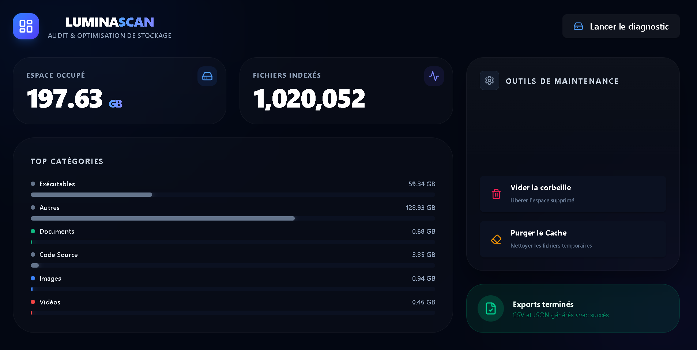
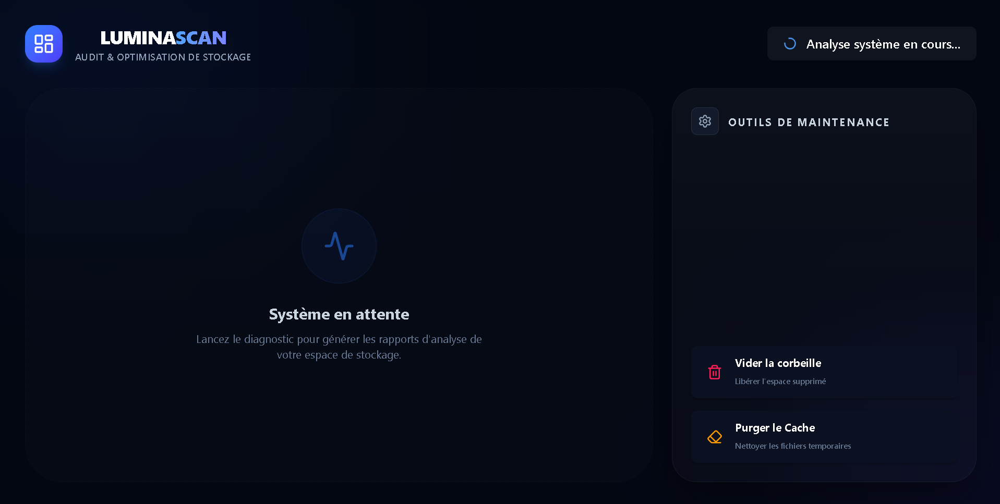

# 🌌 LuminaScan

**LuminaScan** est un outil de diagnostic et d'optimisation de stockage haute performance conçu pour Windows. Alliant la puissance brute de **Rust** à la flexibilité de **Tauri** et **React**, il offre une analyse ultra-rapide de millions de fichiers avec une interface moderne et intuitive.

---

## ✨ Fonctionnalités Clés

* 🚀 **Scan Haute Performance :** Analyse de millions de fichiers en quelques secondes grâce à un moteur multithreadé en Rust.
* 📊 **Visualisation Intelligente :** Répartition automatique par catégories (Exécutables, Code Source, Médias, etc.).
* 🧹 **Outils de Maintenance :**
    * Vidage sécurisé de la corbeille via l'API système Windows.
    * Purge du cache temporaire et des fichiers système inutiles.
* 📄 **Rapports d'Audit :** Exportation automatique des résultats aux formats **CSV** et **JSON**.
* 🎨 **Interface Moderne :** Design Dark-Mode avec esthétique Glassmorphism.

---

## 📸 Aperçu de l'interface

### Tableau de bord principal
Visualisez instantanément l'occupation de votre disque et la répartition des fichiers.


### Analyse en temps réel
Suivi précis de la progression et retour visuel sur l'état du système.


---

## 📥 Téléchargement & Installation

Choisissez le format qui vous convient le mieux dans la section [Releases](https://github.com/[votre-pseudo]/LuminaScan/releases) de ce dépôt :

| Format | Description | Usage Idéal |
| :--- | :--- | :--- |
| **.MSI (Recommandé)** | Installeur Windows standard. Gère proprement les raccourcis et la désinstallation. | Installation fixe sur votre PC. |
| **.EXE (Portable)** | Exécutable direct sans installation. | Test rapide ou utilisation depuis une clé USB. |

> **Note de sécurité Windows :** LuminaScan étant un projet indépendant et open source, il ne possède pas de certificat commercial payant. Au premier lancement, Windows SmartScreen peut afficher une alerte. Cliquez simplement sur *Informations complémentaires* puis *Exécuter quand même*.

---

## 🔒 Sécurité & Confidentialité

LuminaScan a été conçu avec la protection de la vie privée comme priorité absolue :
* **100% Local :** L'application fonctionne entièrement hors-ligne. Aucune donnée, statistique ou historique d'analyse n'est envoyé sur des serveurs externes.
* **Transparence totale :** Le code source est entièrement public, permettant à quiconque d'auditer les opérations effectuées sur le système.
* **Respect du système :** Les opérations de maintenance utilisent exclusivement les API officielles de Windows.

---

## 🛠 Stack Technique

* **Core :** [Rust](https://www.rust-lang.org/) (Performance & Sécurité mémoire)
* **Framework Desktop :** [Tauri](https://tauri.app/)
* **Frontend :** [React](https://reactjs.org/) + [Tailwind CSS](https://tailwindcss.com/)
* **Moteur de scan :** `jwalk` (Parcours de fichiers parallèle)

---

## 💻 Pour les Développeurs (Setup)

### Prérequis
* Node.js (LTS)
* Rust (dernière version stable)

### Démarrage rapide
1.  **Cloner le projet :**
    ```bash
    git clone [https://github.com/](https://github.com/)[votre-pseudo]/LuminaScan.git
    ```
2.  **Installer les dépendances :**
    ```bash
    npm install
    ```
3.  **Lancer en mode développement :**
    ```bash
    npm run tauri dev
    ```

---

## 🗺️ Roadmap

- [ ] **Mode Expert Développeur :** Nettoyage ciblé des `node_modules`, `target`, et `.venv`.
- [ ] **Historique & Snapshots :** Comparaison de deux analyses pour voir l'évolution du stockage.
- [ ] **Détecteur de Doublons :** Identification de fichiers identiques par Hash.

---

## ⚖️ Licence

Ce projet est sous licence **MIT**.
